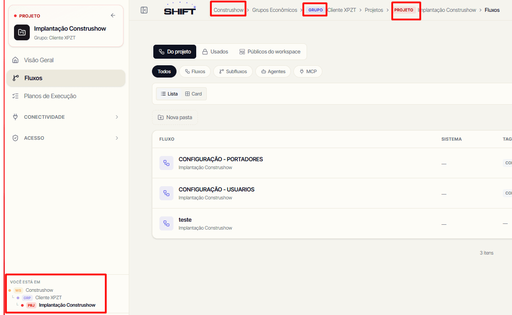
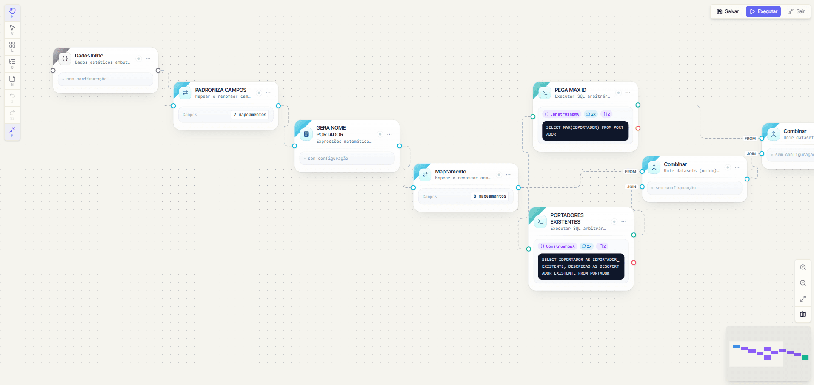
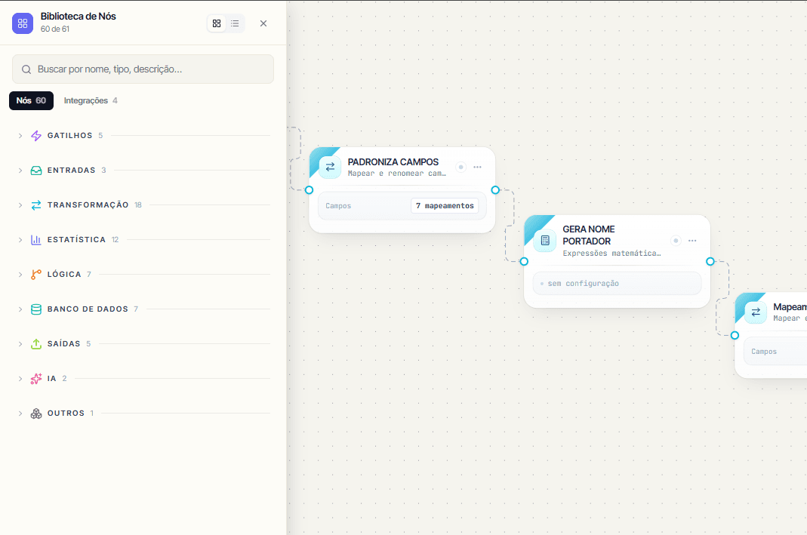

Antes de montar qualquer coisa, vale entender como o Shift organiza o mundo. São duas camadas: uma **hierarquia administrativa**, onde as coisas moram e quem enxerga o quê  e as **peças de um fluxo** (conexão, fluxo, nó). Entendeu essas duas, o resto encaixa.

## A hierarquia

Tudo no Shift vive dentro de uma hierarquia de quatro níveis. Ela não é burocracia: existe por três motivos bem práticos.

- **Isolamento** — os dados de uma empresa nunca encostam nos de outra.

- **Reuso** — o que você define num nível (uma conexão, um modelo de entrada) fica disponível para tudo que está abaixo dele.

- **Permissão** — o seu papel num nível vale para tudo que ele contém. Você dá acesso uma vez, no nível certo, em vez de repetir em cada item.

Do mais amplo ao mais específico, cada nível **contém vários** do nível de baixo:

```
Organização              a empresa dona da instância (ex.: Viasoft)
└── Espaço               um produto ou time  (Workspace)
    └── Grupo econômico  o cliente contratante; agrupa os CNPJs (matriz + filiais)
        └── Projeto      um contrato/engajamento com esse cliente
            └── Fluxo    o trabalho de dados em si
```

Na prática, preenchendo com nomes reais:

```
Viasoft                          (Organização)
└── Sistema XPTZ                 (Espaço — o time que faz migrações)
    └── Padaria Pão Quente       (Grupo econômico — o cliente: 1 matriz + 2 filiais)
        └── Migração ERP 2026    (Projeto — o contrato atual)
            ├── Importa clientes (Fluxo)
            └── Importa produtos (Fluxo)
```

Essa hierarquia aparece na própria URL ao navegar: `…/w/{espaço}/c/{grupo econômico}/projetos` e também na parte inferior do menu lateral.



### Organização

É a **empresa** dona da instância do Shift (ex.: Viasoft). É o teto de tudo: serve para isolar por completo os dados de uma empresa dos de outra. No dia a dia você quase não mexe nela, normalmente existe **uma só** organização, e o trabalho acontece nos níveis de baixo.

### Espaço

Um **produto ou time** dentro da organização, por exemplo, um espaço "Sistema XPTZ" e outro "Sistemas Fiscais". O espaço é a **unidade de colaboração**: é nele que vivem

Quem está num espaço enxerga o que há nele conforme o seu papel. Mudou de espaço, muda o conjunto de clientes, conexões e modelos à sua frente.

### Grupo econômico (Cliente)

O **cliente contratante** — a empresa para quem você faz o trabalho. Chama-se "grupo econômico" porque agrupa **vários CNPJs**: a matriz e suas filiais, todos sob o mesmo guarda-chuva.

Cada grupo econômico carrega informações próprias que ajudam a operar a carteira:

- **Fase** — onde o cliente está no ciclo de vida: `prospect` → `onboarding` → `go_live` → `live` → `maintenance` → `offboarding`.

- **Criticidade** — `low`, `medium`, `high` ou `critical`, para priorizar atenção.

- **CNPJs** — a matriz (marcada como principal) e as filiais.

> Antes, "cliente" e "projeto" se confundiam. Agora são coisas distintas: o **grupo econômico** é *com quem* você trabalha; o **projeto** é *o que* você faz para ele. Um mesmo cliente pode ter vários projetos ao longo do tempo (uma migração hoje, uma integração depois) sem perder o histórico.

### Projeto

Um **engajamento específico** dentro de um grupo econômico,  tipicamente uma migração ou uma integração contratada. É a "pasta de trabalho" onde os **fluxos** moram e rodam contra os dados daquele cliente. Separar por projeto mantém cada contrato organizado: você abre "Migração ERP 2026", vê só os fluxos dele, e o histórico de execuções fica ali.

Por padrão, quem está no espaço vê os projetos dele conforme o seu papel — mas um projeto pode ser marcado como **restrito**, ficando visível só para quem foi adicionado nele, e o próprio cliente final pode receber acesso de leitura a um projeto específico, sem entrar no espaço.

## Conexões, fluxos e nós

Com a hierarquia clara, faltam as três peças que você manipula de verdade no dia a dia.

### Conexão

Apontamento para um banco externo (Oracle, SQL Server, Postgres, Firebird, MySQL): você cadastra as credenciais **uma vez** e reusa em N fluxos. Pense como um **DSN / connection string** guardado e versionado e as senhas ficam protegidas, nunca trafegam em texto claro de volta para você.

O detalhe que mais importa é **onde a conexão vive**. Toda conexão pertence a **exatamente um** dono, e esse dono decide quem pode usá-la:

| **Escopo da conexão** | **Quem enxerga** | **Use quando** |
| --- | --- | --- |
| **Espaço** (compartilhada) | todos os clientes e projetos do espaço | banco interno comum, sandbox compartilhado |
| **Grupo econômico** | todos os projetos daquele cliente | o banco é do cliente, **o caso mais comum** |
| **Projeto** | apenas aquele projeto | isolamento máximo de uma conexão |

A regra de bolso: quanto mais alto o escopo, mais fluxos reaproveitam a mesma conexão; quanto mais baixo, mais isolado. Na dúvida, conexão de **grupo econômico** cobre a maioria dos casos, porque o banco quase sempre é do cliente.

### Fluxo

A peça central: um diagrama de **passos conectados** (os nós) que extrai dados, transforma e carrega. Equivale a um **script SQL com várias etapas** — só que cada etapa é um nó visual com a sua configuração, e você vê o dado andar de um para o outro.

> **Analogia SQL**: imagine um `WITH` encadeado —
> `WITH origem AS (SELECT ...), filtrado AS (... FROM origem WHERE ...), final AS (...) INSERT INTO destino SELECT * FROM final`.
> Cada CTE é um nó, conectados na ordem.

Um fluxo existe em uma de duas formas:

- **Instância** — vive dentro de um **projeto** e roda de verdade contra os dados daquele cliente.

- **Template** — vive no **espaço**, sem cliente, e serve de molde reutilizável. Você **clona** o template para criar uma instância em cada projeto, sem refazer tudo do zero. É assim que um mesmo desenho de migração atende dez clientes parecidos.

Clonar não é a única forma de aproveitar um template: um projeto também pode **usar** um fluxo do espaço diretamente, como sub-fluxo, sem criar uma cópia — útil quando uma correção no template deve valer para todo mundo que o usa, em vez de atualizar clone por clone. O dono do template controla quem enxerga e quem clona: um fluxo pode ficar privado, compartilhado com o espaço, ou publicado como template público, podendo liberar o uso sem liberar a cópia (ex.: um nó personalizado reutilizável, cuja lógica interna fica oculta).



### Nó

Cada **caixinha** num fluxo. A biblioteca de nós agrupa tudo por categoria:

- **Gatilhos** — quando o fluxo dispara (Manual, Agendamento, Webhook, Monitorar Mudanças, ou a Entrada de outro fluxo que o chama).

- **Entradas** — de onde os dados vêm (SELECT em banco, CSV, Excel, HTTP, dados digitados direto no nó, ou uma Base de Dados interna — inclusive alimentada por formulário).

- **Transformação** — como as linhas são manipuladas (Mapeamento, Filtro, Agregador, Remover Duplicatas, Junção, Ordenar, Amostragem, entre outros).

- **Estatística** — cálculos analíticos prontos sobre os dados do fluxo: score de crédito, detecção de anomalia, previsão de demanda, segmentação de clientes (RFM), cesta de compras e afins, sem precisar programar a fórmula.

- **Banco de Dados** — Inserção em Massa numa tabela, Destino SQL, gravação na Base de Dados interna, Limpar Tabela, Dead Letter (guarda linhas que falharam, para reprocessar depois).

- **Saídas** — Exportar CSV/Excel, Relatório em PDF, Saída do Fluxo (quando ele é chamado por outro).

- **Integrações** — conectores prontos com ferramentas externas: Google Sheets (ler e gravar), Gmail (enviar e-mail), WhatsApp via Z-API.

Há ainda nós de **Lógica** (IF, Switch, Loop, Código Python, Chamar Fluxo, Aguardar Todos), **IA** (Analista IA para um laudo em texto, Decisão IA para classificar em categorias) e **Outros** (Nota, Grupo) para organizar e elaborar fluxos mais complexos. O catálogo completo está na seção **Nós**.

Você conecta um nó ao outro arrastando da **bolinha de saída** até a **bolinha de entrada** do próximo. O dado flui por essas ligações, na ordem.


