**Data:** 13/05/2026

**Status:** Proposta arquitetural

**Contexto:** Evolucao do Shift para operar como plataforma SaaS de automacao com execucao local em servidores de clientes

**Objetivo:** Separar a experiencia web de criacao/governanca dos fluxos do motor de execucao local, mantendo compatibilidade com ambientes onde Docker, WSL ou acesso inbound nao sao viaveis.

---

## 1. Sumario executivo

O Shift pode evoluir de uma plataforma web unica para uma arquitetura hibrida, composta por:

- **Shift Cloud / Control Plane:** ambiente central, SaaS, onde ficam usuarios, organizacoes, planos, licencas, catalogo de workflows, publicacao de versoes, atribuicao de fluxos para clientes, monitoramento resumido e diagnosticos.

- **Shift Runner Local / Execution Plane:** servico instalado no servidor do cliente, responsavel por executar workflows dentro da rede local, acessar ERPs, bancos, arquivos, APIs internas e manter logs completos localmente.

- **Shift Local Worker:** processo Python que reaproveita o motor atual do Shift para executar workflows.

- **Shift Runner Agent:** servico leve, preferencialmente em Go, que instala como Windows Service/systemd, sincroniza com a nuvem, valida licenca, baixa workflows, agenda execucoes e supervisiona o worker Python.

- **Shift Plugin Registry:** catalogo central de conectores e nodes, permitindo conectores oficiais, conectores privados por cliente e, futuramente, plugins publicados por uma comunidade controlada.

A ideia central e:

> O Shift Cloud controla, versiona e governa. O Runner Local executa, acessa dados sensiveis e opera dentro do ambiente do cliente.

Essa separacao permite atender dois cenarios:

1. **SaaS puro:** cliente usa a plataforma web e executa em infraestrutura cloud quando os dados estao acessiveis.

2. **Hibrido/local:** cliente usa a plataforma web para criar e gerenciar fluxos, mas a execucao ocorre em um servico instalado no servidor dele.

Para uma empresa de consultoria em automacao de processos, essa arquitetura e estrategica. Ela permite vender o Shift como plataforma central de operacao, mas sem exigir que todos os clientes exponham bancos legados, Firebird, Oracle, pastas de rede ou sistemas internos para a internet.

---

## 2. Motivacao

Hoje o Shift e majoritariamente uma plataforma web com backend Python. Isso funciona bem para desenvolvimento, SaaS e ambientes controlados. Porem, em consultoria de automacao e integracao, surgem restricoes praticas:

- Cliente tem servidor Windows sem Docker.

- Cliente nao permite WSL.

- Cliente nao abre portas inbound.

- ERP so e acessivel na rede interna.

- Banco Firebird/Oracle esta em maquina local.

- Arquivos estao em compartilhamentos de rede.

- Politica de seguranca impede enviar dados brutos para cloud.

- Execucoes precisam continuar mesmo se internet cair.

- O consultor precisa monitorar multiplos clientes em um painel central.

Essas restricoes pedem uma arquitetura com agente local.

---

## 3. Principios da arquitetura

### 3.1 Cloud governa, local executa

O cloud deve ser o lugar de:

- usuarios;

- planos;

- licencas;

- catalogo de workflows;

- versoes publicadas;

- atribuicoes de workflows para clientes/runners;

- comandos remotos;

- telemetria resumida;

- diagnosticos redatados;

- atualizacoes.

O local deve ser o lugar de:

- conexoes reais com ERP/bancos internos;

- credenciais sensiveis;

- execucoes completas;

- logs detalhados;

- checkpoints;

- staging DuckDB;

- dados temporarios;

- dead letters;

- retries locais.

### 3.2 Comunicacao outbound

O Runner Local deve iniciar a comunicacao com o Shift Cloud. Isso evita exigir que o cliente abra portas no firewall.

Modelo recomendado:

```
Runner Local -> Shift Cloud
```

Nunca depender inicialmente de:

```
Shift Cloud -> servidor do cliente
```

### 3.3 Offline-first controlado

O Runner deve continuar operando por um periodo se a internet cair:

- executa workflows ja sincronizados;

- guarda eventos em outbox local;

- tenta reenviar quando voltar;

- respeita grace period de licenca;

- nao baixa novas versoes enquanto offline.

### 3.4 Dados sensiveis ficam locais por padrao

O cloud nao deve receber dados brutos de execucao por padrao.

Enviar para cloud:

- status;

- contadores;

- duracao;

- erro redatado;

- stack tecnico sanitizado;

- tabelas afetadas;

- hashes/fingerprints;

- versoes;

- healthcheck.

Nao enviar sem opt-in:

- linhas de dados;

- dumps;

- credenciais;

- connection strings;

- arquivos de staging;

- payloads completos.

### 3.5 Workflow versionado e assinado

O Runner deve executar apenas pacotes de workflow imutaveis, versionados e assinados pelo cloud.

Isso cria confianca operacional:

- evita alteracao local nao autorizada;

- permite auditoria;

- permite rollback;

- garante compatibilidade com versao minima do runner;

- permite provar qual versao rodou.

### 3.6 Motor atual deve ser reaproveitado

Nao faz sentido reescrever o motor de ETL em outra linguagem neste momento.

O motor atual do Shift ja possui:

- Python;

- DuckDB;

- SQLAlchemy;

- dlt;

- conectores;

- dynamic runner;

- nodes;

- load_service;

- extraction_service;

- logs;

- metricas;

- validacoes.

A arquitetura deve extrair esse motor para um pacote reutilizavel, nao descarta-lo.

---

## 4. Visao geral

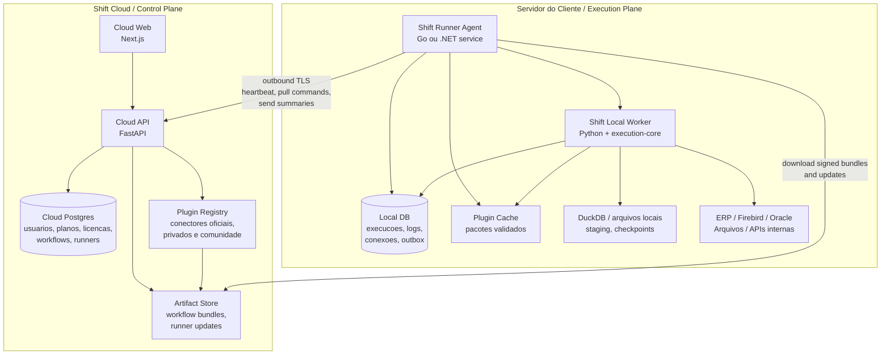

---

## 5. Componentes

## 5.1 Shift Cloud Web

Aplicacao web principal, hoje representada pelo frontend do Shift.

Responsabilidades:

- editor visual de workflows;

- futuro editor Procedure Flow;

- gestao de workspaces/clientes/projetos;

- publicacao de versoes;

- atribuicao de workflows para runners;

- painel de monitoramento;

- logs resumidos;

- diagnosticos;

- gestao de planos/licencas;

- gestao de templates e catalogo.

Tecnologia sugerida:

- manter Next.js/React atual.

## 5.2 Shift Cloud API

Backend cloud, hoje derivado do backend atual, mas futuramente separado do motor de execucao local.

Responsabilidades:

- autenticacao;

- autorizacao;

- multi-tenant;

- licencas;

- planos;

- runners;

- deployments;

- workflow catalog;

- workflow versions;

- comandos para runners;

- recebimento de telemetria;

- gerenciamento de updates;

- API para o frontend.

Tecnologia sugerida:

- manter FastAPI/Python;

- Postgres cloud;

- Alembic;

- filas internas se necessario.

## 5.3 Shift Runner Agent

Servico local instalado no servidor do cliente.

Responsabilidades:

- rodar como Windows Service ou systemd;

- ler configuracao local;

- registrar/ativar runner;

- validar licenca;

- fazer heartbeat;

- puxar comandos pendentes;

- baixar workflow bundles;

- validar assinatura de bundles;

- armazenar workflows localmente;

- agendar execucoes;

- iniciar/parar/cancelar worker Python;

- capturar eventos do worker;

- persistir eventos localmente;

- enviar resumo para cloud;

- manter outbox offline;

- atualizar o runner/worker quando autorizado.

Tecnologia recomendada:

- **Go** para o agent.

Motivos:

- binario unico;

- cross-platform;

- bom para Windows Service/systemd;

- baixo consumo;

- excelente para rede, processos, TLS, concorrencia e supervisao;

- nao exige runtime no servidor do cliente.

Alternativa aceitavel:

- .NET, especialmente se o foco for Windows Server.

## 5.4 Shift Local Worker

Processo que executa workflows usando o motor Python.

Responsabilidades:

- carregar job local;

- carregar workflow bundle;

- resolver conexoes locais;

- executar workflow via execution-core;

- acessar bancos/arquivos/APIs internas;

- gravar execucoes locais;

- emitir eventos JSON para o agent;

- respeitar cancelamento;

- retornar resultado final.

Tecnologia recomendada:

- Python, reaproveitando o motor atual.

Distribuicao recomendada:

- Python embutido/portatil junto com o instalador.

Exemplo no Windows:

```
C:\Program Files\Shift Runner\
  shift-runner.exe
  runtime\
    python.exe
    python311.dll
    Lib\
    site-packages\
      shift_worker\
      shift_execution\
      duckdb\
      sqlalchemy\
      ...
```

O cliente nao instala Python. O Runner leva o Python junto.

## 5.5 Execution Core

Pacote Python extraido do backend atual, contendo o motor de execucao.

Responsabilidades:

- dynamic runner;

- nodes;

- transformacoes;

- bulk insert;

- composite insert;

- loop;

- procedure flow;

- DuckDB storage;

- extraction service;

- load service;

- schemas de workflow;

- parameter value;

- risk/strategy.

Este pacote deve ser usado por:

- Cloud API, quando executar no modo cloud;

- Local Worker, quando executar no servidor do cliente;

- testes automatizados.

---

## 6. Estrutura sugerida do monorepo

Estado desejado:

```
shift-project/
  apps/
    cloud-web/
    cloud-api/
    local-worker/
    runner-agent/
    mcp-server/

  packages/
    execution-core/
    contracts/
    shared-python/
    shared-ts/

  ops/
    cloud/
    runner/
    installers/
    docker/
    observability/

  docs/
    architecture/
    runner/
    cloud/
    product/
```

## 6.1 Mapeamento a partir do projeto atual

```
shift-frontend/   -> apps/cloud-web/
shift-backend/    -> apps/cloud-api/ + packages/execution-core/
shift-mcp-server/ -> apps/mcp-server/
ops/              -> ops/
docs/             -> docs/
```

## 6.2 apps/cloud-web

```
apps/cloud-web/
  package.json
  next.config.mjs
  app/
  components/
  lib/
  public/
  content/
```

Responsabilidade:

- toda experiencia visual;

- editor DAG;

- futuro editor vertical Procedure Flow;

- dashboards de clientes/runners;

- painel de monitoramento.

## 6.3 apps/cloud-api

```
apps/cloud-api/
  pyproject.toml
  alembic.ini
  shift_cloud/
    main.py
    api/
      v1/
        auth.py
        organizations.py
        workspaces.py
        workflows.py
        workflow_versions.py
        runners.py
        deployments.py
        licenses.py
        telemetry.py
        updates.py

    models/
      organization.py
      user.py
      workflow_catalog.py
      workflow_version.py
      runner.py
      deployment.py
      license.py
      execution_summary.py
      telemetry.py

    services/
      license_service.py
      runner_registry_service.py
      deployment_service.py
      workflow_publish_service.py
      telemetry_service.py
      update_service.py

    db/
      session.py
      base.py

    core/
      config.py
      security.py
      encryption.py
      logging.py

  alembic/
    versions/
```

Responsabilidade:

- controle global;

- nao depender de acesso direto aos bancos do cliente;

- nao armazenar credenciais locais do cliente, salvo se explicitamente desenhado para isso e criptografado.

## 6.4 packages/execution-core

```
packages/execution-core/
  pyproject.toml
  shift_execution/
    orchestration/
      dynamic_runner.py
      execution_plan.py
      parameter_resolver.py
      strategy_resolver.py
      strategy_observer.py
      node_profile.py

    nodes/
      __init__.py
      manual_trigger.py
      sql_database.py
      sql_script.py
      loop.py
      transform_node.py
      bulk_insert.py
      composite_insert.py
      load_node.py
      truncate_table.py
      if_node.py
      switch_node.py
      mapper_node.py
      filter_node.py
      ...

    data_pipelines/
      duckdb_storage.py
      sql_extractor.py
      migrator.py

    services/
      extraction_service.py
      load_service.py
      connection_resolver.py
      checkpoint_service.py
      dead_letter_service.py

    schemas/
      workflow.py
      transform_primitives.py
      connection.py

    procedure_flow/
      schemas.py
      executor.py
      context.py
      validators.py
      risk.py
      sql_runner.py
      events.py

    observability/
      events.py
      metrics.py
      tracing.py
      log_sanitizer.py

    security/
      secrets.py
      redaction.py
```

Responsabilidade:

- conter o motor puro;

- nao depender de FastAPI cloud;

- nao depender diretamente dos modelos SQLAlchemy cloud;

- receber dependencias por interfaces: conexoes, event sink, local storage, secrets.

## 6.5 apps/local-worker

```
apps/local-worker/
  pyproject.toml
  shift_worker/
    main.py
    cli.py
    job_loader.py
    event_writer.py
    local_db.py
    local_secrets.py
    connection_provider.py
    workflow_bundle_loader.py
    cancellation.py
```

Exemplo de execucao:

```
runtime\python.exe -m shift_worker execute --job data\jobs\job-123.json
```

Responsabilidade:

- ser casca fina sobre `execution-core`;

- executar um job por processo ou por worker controlado;

- emitir eventos JSON no stdout;

- gravar detalhes localmente.

## 6.6 apps/runner-agent

Exemplo em Go:

```
apps/runner-agent/
  go.mod
  cmd/
    shift-runner/
      main.go

  internal/
    config/
      config.go
    service/
      windows.go
      systemd.go
    heartbeat/
      heartbeat.go
    sync/
      client.go
      downloader.go
      verifier.go
    supervisor/
      worker.go
      process.go
      cancellation.go
    localdb/
      db.go
      migrations.go
    scheduler/
      scheduler.go
    outbox/
      outbox.go
    updater/
      updater.go
    logging/
      logging.go
```

Responsabilidade:

- produto instalavel;

- supervisionar;

- sincronizar;

- operar offline;

- nao conter regra de ETL.

## 6.7 packages/contracts

```
packages/contracts/
  schemas/
    workflow-bundle.schema.json
    execution-job.schema.json
    execution-event.schema.json
    runner-heartbeat.schema.json
    runner-command.schema.json
    license-token.schema.json

  examples/
    workflow-bundle.example.json
    execution-job.example.json
    execution-event.node-complete.json
    runner-heartbeat.example.json

  openapi/
    runner-cloud-api.yaml

  generated/
    python/
    typescript/
    go/
```

Responsabilidade:

- evitar acoplamento implicito;

- versionar contratos;

- permitir que Go, Python e TypeScript falem a mesma lingua.

---

## 7. Banco de dados cloud

O banco cloud deve controlar o negocio e a governanca.

Sugestao de tabelas:

```
organizations
users
memberships
plans
licenses
license_entitlements

workflow_catalog
workflow_versions
workflow_artifacts
workflow_deployments

runners
runner_environments
runner_capabilities
runner_heartbeats
runner_commands
runner_command_results

execution_summaries
execution_diagnostics
telemetry_events

update_channels
runner_releases
runner_release_artifacts
```

## 7.1 runners

Representa uma instalacao local.

Campos sugeridos:

```
id
organization_id
client_id
environment_name        # producao, homologacao, filial-x
display_name
runner_token_hash
status                  # pending, active, revoked, offline
last_seen_at
runner_version
worker_version
os
arch
hostname_hash
created_at
revoked_at
```

## 7.2 workflow_versions

Versao imutavel publicada.

Campos:

```
id
workflow_id
version
semantic_hash
definition
variables_schema
required_capabilities
minimum_runner_version
artifact_uri
signature
published_by
published_at
```

## 7.3 workflow_deployments

Define qual workflow versionado deve ir para qual runner/ambiente.

Campos:

```
id
workflow_version_id
runner_id
environment
status                  # pending, deployed, failed, paused
schedule_policy
enabled
created_at
deployed_at
```

## 7.4 runner_commands

Fila logica de comandos para o runner puxar.

Tipos:

- `sync_workflow`

- `execute_workflow`

- `cancel_execution`

- `update_runner`

- `rotate_license`

- `collect_diagnostics`

- `pause_workflow`

- `resume_workflow`

Campos:

```
id
runner_id
command_type
payload
status                  # pending, leased, completed, failed, expired
lease_until
created_at
expires_at
result
```

## 7.5 execution_summaries

Resumo de execucao recebido do runner.

Campos:

```
id
runner_id
local_execution_id
workflow_id
workflow_version
status
started_at
completed_at
duration_ms
node_count
error_count
warning_count
rows_in
rows_out
redacted_error
diagnostic_ref
created_at
```

---

## 8. Banco de dados local

O banco local deve ser simples e resistente.

Opcoes:

- SQLite para MVP e instalacao facil.

- Postgres local opcional em clientes maiores.

Sugestao inicial: SQLite.

Tabelas:

```
runner_state
local_workflow_versions
local_jobs
local_executions
local_node_executions
local_execution_logs
local_connections
local_secrets
sync_outbox
dead_letters
local_schedules
```

## 8.1 runner_state

Estado local do agent.

```
key
value
updated_at
```

Exemplos:

- `runner_id`

- `activation_status`

- `last_successful_sync_at`

- `license_expires_at`

- `cloud_base_url`

## 8.2 local_workflow_versions

Workflow bundles disponiveis localmente.

```
id
cloud_workflow_id
cloud_version_id
version
semantic_hash
definition_json
artifact_path
signature
status                  # available, deprecated, invalid
received_at
```

## 8.3 local_jobs

Fila local.

```
id
cloud_command_id
workflow_version_local_id
triggered_by
payload_json
status                  # queued, running, completed, failed, cancelled
attempt_count
created_at
started_at
completed_at
```

## 8.4 local_executions

Execucao local completa.

```
id
job_id
workflow_version_local_id
status
input_data
result_summary
started_at
completed_at
error_message
```

## 8.5 sync_outbox

Eventos que precisam ser enviados para o cloud.

```
id
event_type
payload_json
status                  # pending, sending, sent, failed
attempt_count
next_attempt_at
created_at
sent_at
```

---

## 9. Comunicacao cloud-runner

## 9.1 Principio

Toda comunicacao deve ser iniciada pelo runner:

```
Runner -> Cloud
```

## 9.2 Protocolos possiveis

### Polling HTTPS

Mais simples para MVP.

Fluxo:

```
POST /runner/heartbeat
POST /runner/commands/pull
POST /runner/events/batch
GET  /runner/artifacts/{id}
```

Vantagens:

- simples;

- funciona em redes restritivas;

- facil de debugar;

- bom para MVP.

Desvantagens:

- latencia depende do intervalo.

### WebSocket outbound

Bom para comandos quase em tempo real.

Vantagens:

- menor latencia;

- cloud pode mandar aviso no canal ja aberto;

- ainda e outbound.

Desvantagens:

- mais sensivel a proxies;

- reconexao exige cuidado.

### gRPC stream

Bom para produto maduro.

Vantagens:

- contrato forte;

- streaming bidirecional;

- eficiente.

Desvantagens:

- mais complexo para ambientes corporativos.

### Recomendacao

Comecar com polling HTTPS. Evoluir para WebSocket/gRPC apenas se necessario.

---

## 10. Fluxos principais

## 10.1 Ativacao do runner

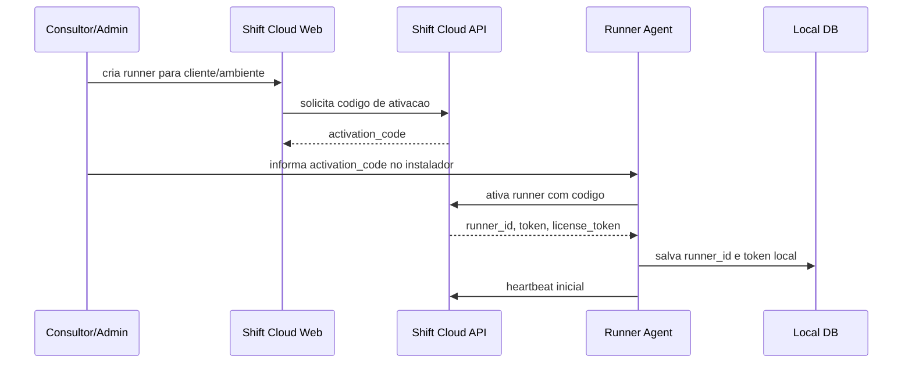

## 10.2 Publicacao e sincronizacao de workflow

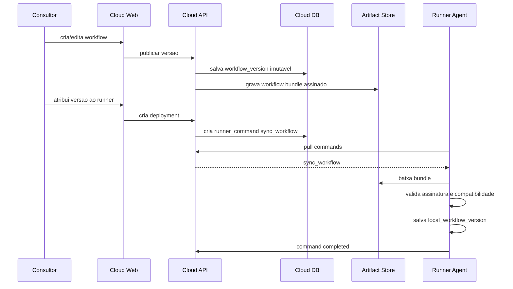

## 10.3 Execucao remota comandada pelo cloud

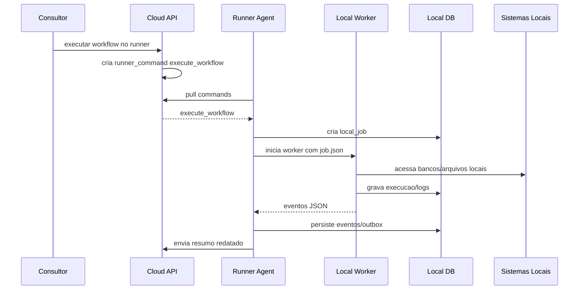

## 10.4 Execucao por agenda local

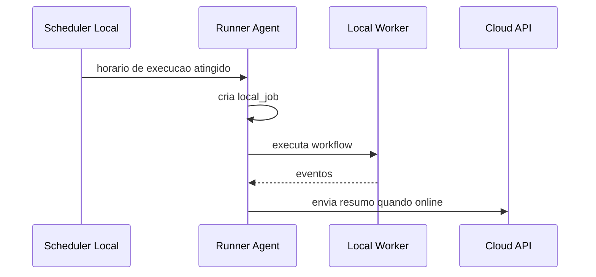

## 10.5 Operacao offline

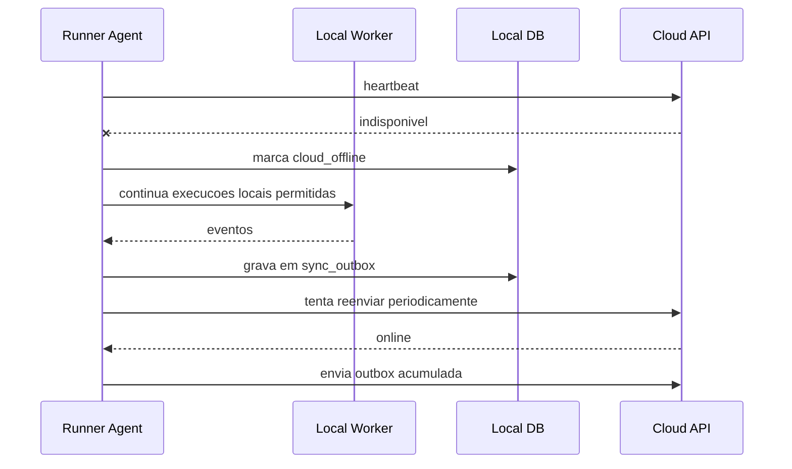

---

## 11. Contratos

## 11.1 WorkflowBundle

Pacote imutavel baixado pelo runner.

```
{
  "bundle_version": "1.0",
  "workflow_id": "uuid",
  "workflow_version_id": "uuid",
  "version": 12,
  "semantic_hash": "sha256...",
  "minimum_runner_version": "0.4.0",
  "required_capabilities": [
    "duckdb",
    "sqlalchemy",
    "firebird",
    "procedure_flow_v1"
  ],
  "definition": {},
  "variables_schema": [],
  "created_at": "2026-05-13T00:00:00Z",
  "signature": "base64..."
}
```

## 11.2 ExecutionJob

Job local criado pelo agent.

```
{
  "job_id": "local-job-id",
  "cloud_command_id": "uuid-or-null",
  "workflow_id": "uuid",
  "workflow_version_id": "uuid",
  "triggered_by": "cloud_manual",
  "input_data": {
    "I_ESTAB": 1
  },
  "execution_policy": {
    "timeout_seconds": 3600,
    "allow_network": true,
    "send_diagnostics": true
  }
}
```

## 11.3 ExecutionEvent

Eventos emitidos pelo worker.

```
{
  "type": "node_complete",
  "job_id": "local-job-id",
  "execution_id": "local-exec-id",
  "timestamp": "2026-05-13T10:30:00Z",
  "node_id": "node_123",
  "node_type": "bulk_insert",
  "status": "success",
  "duration_ms": 320,
  "row_count_in": 1000,
  "row_count_out": 1000,
  "summary": {
    "table": "ITEM",
    "warnings": []
  }
}
```

## 11.4 RunnerHeartbeat

```
{
  "runner_id": "uuid",
  "runner_version": "0.4.0",
  "worker_version": "0.4.0",
  "os": "windows",
  "arch": "amd64",
  "status": "online",
  "local_time": "2026-05-13T10:30:00-03:00",
  "queue": {
    "running": 1,
    "queued": 3,
    "failed_pending_sync": 2
  },
  "capabilities": [
    "duckdb",
    "firebird",
    "oracle",
    "procedure_flow_v1"
  ]
}
```

---

## 12. Execucao local: Go Agent + Python Worker

## 12.1 Por que dois processos

O agent e o worker tem naturezas diferentes.

Agent:

- produto instalavel;

- servico sempre ligado;

- sincronizacao;

- licenca;

- update;

- supervisao;

- rede.

Worker:

- execucao de dados;

- DuckDB;

- SQLAlchemy;

- drivers;

- nodes;

- ETL.

Misturar tudo em um unico processo aumentaria o risco.

## 12.2 Responsabilidade do Go Agent

```
shift-runner.exe
  - roda como servico
  - baixa comandos
  - salva jobs
  - chama worker
  - captura stdout
  - persiste eventos
  - envia outbox
```

## 12.3 Responsabilidade do Python Worker

```
shift-worker
  - carrega job
  - carrega workflow bundle
  - resolve conexoes locais
  - executa workflow
  - emite eventos JSON
  - encerra com exit code padrao
```

## 12.4 Comunicacao Agent -> Worker

Opcao simples:

```
Agent grava job.json
Agent executa worker
Worker emite eventos JSON no stdout
Agent le stdout linha a linha
Worker grava detalhes no banco local
Agent interpreta exit code
```

Exemplo:

```
shift-worker.exe execute --job C:\ProgramData\ShiftRunner\jobs\job-123.json
```

Eventos:

```
{"type":"execution_start","execution_id":"exec-1"}
{"type":"node_start","node_id":"n1"}
{"type":"node_complete","node_id":"n1","status":"success","row_count_out":120}
{"type":"execution_complete","status":"success"}
```

## 12.5 Exit codes

```
0  success
1  functional failure
2  validation failure
3  cancelled
4  timeout
5  infrastructure error
```

---

## 13. Distribuicao local

## 13.1 Windows

Instalacao esperada:

```
C:\Program Files\Shift Runner\
  shift-runner.exe
  shift-worker.exe                 # opcional, se empacotado
  runtime\
    python.exe                     # opcao recomendada inicialmente
    python311.dll
    Lib\
    site-packages\
      shift_worker\
      shift_execution\
      duckdb\
      sqlalchemy\
  drivers\
    firebird\
    oracle\
    odbc\
  config\
    runner.yaml

C:\ProgramData\Shift Runner\
  data\
    runner.db
    jobs\
    workflows\
    duckdb\
    checkpoints\
  logs\
```

O servico Windows roda:

```
shift-runner.exe service run
```

## 13.2 Linux

```
/opt/shift-runner/
  shift-runner
  runtime/
  config/

/var/lib/shift-runner/
  runner.db
  jobs/
  workflows/
  duckdb/

/var/log/shift-runner/
```

systemd:

```
[Unit]
Description=Shift Runner
After=network-online.target

[Service]
ExecStart=/opt/shift-runner/shift-runner service run
Restart=always
User=shift-runner

[Install]
WantedBy=multi-user.target
```

## 13.3 Python embutido

Python embutido significa entregar o runtime Python junto do produto.

O cliente nao instala Python.

Vantagens:

- nao depende do ambiente;

- sem WSL;

- sem Docker;

- versao controlada;

- dependencias testadas.

Desvantagens:

- instalador maior;

- builds separados por SO/arquitetura;

- drivers nativos exigem cuidado.

---

## 14. Licenciamento

## 14.1 Modelo

O cloud emite um token de licenca assinado para o runner.

O runner valida localmente:

- assinatura;

- plano;

- cliente;

- validade;

- limites;

- grace period.

## 14.2 Grace period

Exemplo:

```
Licenca valida ate: 2026-06-01
Grace period: 15 dias
Bloqueio forte: 2026-06-16
```

Durante grace:

- continua executando workflows ja sincronizados;

- alerta no cloud quando voltar;

- nao baixa novos fluxos se a politica exigir.

## 14.3 Entitlements

Possiveis limites:

- numero de workflows ativos;

- execucoes por mes;

- runners por organizacao;

- conectores habilitados;

- Procedure Flow habilitado;

- IA habilitada;

- concorrencia local;

- retencao de logs.

---

## 15. Seguranca

## 15.1 Autenticacao runner-cloud

Recomendado:

- runner token gerado na ativacao;

- token armazenado localmente com protecao do SO;

- rotacao periodica;

- TLS obrigatorio.

Opcional futuro:

- mTLS;

- certificado por runner.

## 15.2 Assinatura de bundles

Todo workflow bundle deve ser assinado pelo cloud.

O runner deve validar:

- assinatura;

- hash;

- organizacao;

- runner destino;

- versao minima;

- expiracao se aplicavel.

## 15.3 Segredos locais

Credenciais de banco devem ficar no local.

No Windows:

- DPAPI;

- Windows Credential Manager;

- arquivo criptografado com chave protegida pelo sistema.

No Linux:

- arquivo criptografado com permissao restrita;

- opcional integration com secret manager local.

## 15.4 Redacao de logs

Antes de enviar algo para cloud:

- remover connection strings;

- remover senhas;

- remover tokens;

- mascarar CPF/CNPJ se necessario;

- limitar tamanho de erro;

- remover payloads de dados.

---

## 16. Atualizacao

## 16.1 Tipos de atualizacao

- Agent update;

- Worker/runtime update;

- Workflow bundle update;

- Driver package update.

## 16.2 Politica recomendada para MVP

No MVP, evitar auto-update agressivo.

Preferir:

- cloud informa que ha update;

- consultor autoriza;

- runner baixa pacote;

- instala em janela segura;

- mantem versao anterior para rollback.

## 16.3 Estrutura de releases

```
runner_releases
  version
  channel          # stable, beta, internal
  os
  arch
  artifact_uri
  checksum
  signature
  release_notes
  minimum_cloud_version
```

---

## 17. Observabilidade e suporte

## 17.1 Painel global

O cloud deve mostrar:

- runners online/offline;

- ultima execucao;

- versao instalada;

- fila local;

- falhas por cliente;

- conectores com erro;

- latencia de sync;

- workflows desatualizados;

- licencas proximas do vencimento.

## 17.2 Diagnostico sob demanda

Comando cloud:

```
collect_diagnostics
```

Runner retorna:

- versao;

- OS;

- conectividade com cloud;

- espaco em disco;

- status do banco local;

- ultimos erros redatados;

- drivers instalados;

- conectores testados se permitido.

## 17.3 Sem acesso remoto invasivo

O desenho nao exige:

- RDP;

- SSH;

- porta aberta;

- VPN;

- acesso direto ao banco do cliente.

Isso reduz atrito comercial.

---

## 18. Impacto no codigo atual

## 18.1 O que precisa ser extraido

Do backend atual para `execution-core`:

- `app/orchestration/flows/*`

- `app/services/workflow/nodes/*`

- `app/data_pipelines/*`

- `app/services/load_service.py`

- `app/services/extraction_service.py`

- `app/services/checkpoint_service.py`, se aplicavel

- `app/schemas/workflow.py`

- `app/schemas/transform_primitives.py`

- `app/services/workflow/parameter_value.py`

- log sanitizer e partes de observabilidade.

## 18.2 O que fica no cloud-api

- auth;

- usuarios;

- organizacoes;

- workspaces;

- clientes;

- planos;

- licencas;

- catalogo de workflows;

- versoes;

- runners;

- deployments;

- telemetria;

- APIs do frontend.

## 18.3 Interfaces necessarias

Para o `execution-core` nao depender do backend cloud, criar interfaces:

```
class ConnectionProvider:
    def get_connection(self, connection_id: str) -> ResolvedConnection: ...

class EventSink:
    async def emit(self, event: dict) -> None: ...

class ExecutionStorage:
    async def save_node_execution(...): ...

class SecretProvider:
    def get_secret(self, name: str) -> str: ...
```

Cloud e local implementam essas interfaces de formas diferentes.

---

## 19. Plano de migracao

## Fase 0 - Contratos e recorte

**Objetivo:** definir contratos antes de mover codigo.

Entregas:

- `ExecutionJob`;

- `ExecutionEvent`;

- `WorkflowBundle`;

- `RunnerHeartbeat`;

- `RunnerCommand`;

- exemplos JSON;

- decisao de campos obrigatorios.

## Fase 1 - Extrair execution-core

**Objetivo:** separar motor Python do backend FastAPI.

Entregas:

- criar pacote `packages/execution-core`;

- mover runner/nodes/services;

- ajustar imports;

- backend atual passa a importar `execution-core`;

- testes continuam passando.

## Fase 2 - Criar local-worker Python

**Objetivo:** executar workflow fora do backend.

Entregas:

- CLI `shift_worker execute --job job.json`;

- carrega workflow bundle local;

- executa com banco local fake/inicial;

- emite eventos JSON;

- grava logs locais.

## Fase 3 - Cloud runner registry

**Objetivo:** cloud reconhecer runners.

Entregas:

- tabelas `runners`, `runner_commands`, `workflow_deployments`;

- endpoints de ativacao;

- heartbeat;

- pull commands;

- upload de eventos.

## Fase 4 - Runner agent simples

**Objetivo:** servico local funcional.

Entregas:

- Go agent;

- config local;

- heartbeat;

- pull commands;

- download de bundle;

- chamar local-worker;

- outbox local.

## Fase 5 - Instalador e runtime embutido

**Objetivo:** instalar sem Docker/WSL/Python externo.

Entregas:

- pacote Windows;

- servico Windows;

- runtime Python embutido;

- estrutura `Program Files` + `ProgramData`;

- logs locais.

## Fase 6 - Hardening

**Objetivo:** produto operavel em cliente real.

Entregas:

- assinatura de bundle;

- licenca local;

- grace period;

- cancelamento;

- retry;

- atualizacao assistida;

- diagnostico remoto redatado.

## Fase 7 - Escala e recursos avancados

Possiveis entregas:

- WebSocket/gRPC;

- multi-worker local;

- Postgres local opcional;

- auto-update completo;

- mTLS;

- storage remoto opcional para arquivos de diagnostico.

---

## 20. Decisoes recomendadas

### 20.1 Linguagem do agent

Recomendacao:

- Go para `runner-agent`.

Justificativa:

- binario unico;

- leve;

- cross-platform;

- bom para servico;

- bom para rede/processos;

- nao exige runtime.

### 20.2 Linguagem do worker

Recomendacao:

- Python para `local-worker`.

Justificativa:

- reaproveita motor atual;

- melhor ecossistema para dados;

- evita reescrita cara;

- mantem compatibilidade com DuckDB/SQLAlchemy/dlt.

### 20.3 Banco local

Recomendacao:

- SQLite no MVP;

- Postgres local opcional depois.

### 20.4 Comunicacao

Recomendacao:

- polling HTTPS no MVP;

- WebSocket/gRPC apenas depois.

### 20.5 Deploy local

Recomendacao:

- Windows Service para Windows;

- systemd para Linux;

- Docker opcional, nao obrigatorio.

---

## 21. Riscos e mitigacoes

| Risco | Impacto | Mitigacao |
| --- | --- | --- |
| Extracao do motor quebrar backend atual | Alto | Fazer por fases, backend continua importando pacote extraido |
| Dependencias Python nativas no Windows | Medio/alto | Runtime embutido, matriz de testes, empacotamento controlado |
| Cliente sem internet constante | Medio | Outbox, offline mode, grace period |
| Vazamento de dados sensiveis para cloud | Alto | Redacao, opt-in para amostras, segredo local |
| Atualizacao quebrar runner | Alto | Canais, rollback, update assistido |
| Go agent virar motor paralelo | Alto | Limitar Go a supervisor/sync |
| Contratos mal definidos | Alto | Criar `packages/contracts` antes do agent |
| Plugin malicioso ou mal escrito | Alto | Assinatura, allowlist, permissoes declaradas, revisao e isolamento progressivo |
| Conector de comunidade quebrar workflows | Medio/alto | Versionamento semantico, pin de versao por workflow e canal de aprovacao por organizacao |

---

## 22. Primeiro MVP recomendado

O menor MVP que valida a tese:

1. Criar `ExecutionJob` e `ExecutionEvent`.

2. Criar `local-worker` Python que roda um workflow salvo em JSON.

3. Criar banco local SQLite simples.

4. Criar endpoints cloud:

  - registrar runner;

  - heartbeat;

  - pull command;

  - upload event.

5. Criar agent simples em Go:

  - roda em foreground inicialmente;

  - faz heartbeat;

  - puxa job;

  - chama worker;

  - envia resumo.

6. Depois transformar em Windows Service.

Essa ordem evita gastar meses em instalador/updater antes de validar o contrato principal.

---

## 23. Extensibilidade com plugins e conectores

Uma decisao importante para o futuro do Shift e nao tratar nodes e conectores como recursos fixos do core.

Se o objetivo e transformar o Shift em uma plataforma de automacao e integracao, o core precisa saber executar contratos, e nao conhecer todos os conectores diretamente.

Em outras palavras:

```
Modelo limitado:
node existe porque frontend e backend conhecem esse node no codigo

Modelo recomendado:
node existe porque um plugin registrou um contrato, um schema de UI,
um schema de entrada/saida, permissoes e um runtime de execucao
```

Essa camada permite que o Shift evolua para:

- conectores oficiais, mantidos pelo proprio produto;

- conectores privados, criados por consultores ou clientes;

- conectores low-code, criados pela interface sem codigo;

- conectores de comunidade, publicados em um marketplace controlado;

- nodes internos reutilizaveis entre Cloud Worker e Runner Local.

## 23.1 Objetivo da camada de plugins

A camada de plugins deve permitir adicionar novas capacidades ao Shift sem alterar o core a cada nova integracao.

Exemplos:

- Slack;

- Microsoft Teams;

- WhatsApp;

- Gmail;

- Outlook;

- Google Sheets;

- SAP;

- Protheus;

- Bling;

- Tiny;

- RD Station;

- HubSpot;

- Firebird customizado;

- Oracle ERP legado;

- APIs internas de clientes;

- conectores de arquivos proprietarios;

- nodes de transformacao especificos de um segmento.

O core do Shift continuaria responsavel por:

- orquestracao;

- execucao;

- logs;

- retries;

- credenciais;

- versionamento;

- permissao;

- auditoria;

- agendamento;

- sincronizacao Cloud/Runner.

O plugin ficaria responsavel por:

- declarar quais nodes oferece;

- declarar como a configuracao aparece na UI;

- declarar quais entradas e saidas existem;

- declarar quais permissoes precisa;

- executar a logica especifica do conector;

- mascarar dados sensiveis nos logs;

- informar compatibilidade minima com runner/worker.

## 23.2 Tipos de extensibilidade

Recomendacao: evoluir em quatro niveis, sem liberar tudo de uma vez.

### Nivel 1 - Nodes core

Sao nodes essenciais que continuam fazendo parte do produto:

- SQL query;

- mapper;

- transform;

- loop;

- condition;

- bulk insert;

- composite insert;

- procedure flow;

- file read/write;

- HTTP request generico.

Esses nodes formam a base do Shift e devem ter qualidade de produto.

### Nivel 2 - Conectores low-code

O usuario cria conectores pela propria interface, sem escrever codigo.

Exemplo:

- definir base URL;

- escolher autenticacao;

- cadastrar endpoints;

- configurar headers;

- mapear request/response;

- declarar campos de entrada;

- declarar campos de saida;

- testar chamada;

- publicar como node reutilizavel.

Esse nivel e muito importante para consultoria, porque muitos clientes possuem APIs simples, mas especificas.

Um conector low-code poderia gerar nodes como:

```
crm_cliente.buscar_cliente
crm_cliente.criar_pedido
crm_cliente.atualizar_status
```

Sem necessidade de criar pacote Python.

### Nivel 3 - Plugins privados

Plugins privados sao pacotes criados por:

- equipe interna;

- consultores;

- parceiros;

- equipe tecnica do cliente.

Eles podem conter codigo Python e ficar disponiveis apenas para uma organizacao, um cliente ou um workspace.

Casos comuns:

- ERP local com regra proprietaria;

- leitura de arquivo fiscal especifico;

- integracao com banco legado;

- adaptador de API sem documentacao boa;

- automacao de processo interno que exige bibliotecas especiais.

Para consultoria, esse nivel e estrategico: permite criar aceleradores reutilizaveis sem tornar tudo publico.

### Nivel 4 - Marketplace/comunidade

Plugins de comunidade devem existir, mas com governanca.

Nao e recomendavel permitir que qualquer pacote rode automaticamente no servidor de um cliente.

O marketplace deveria ter classificacoes:

- **Oficial:** mantido e suportado pelo Shift.

- **Verificado:** terceiro revisado, assinado e aprovado.

- **Comunidade:** publicado por terceiros, com aviso explicito.

- **Privado:** disponivel apenas para uma organizacao.

- **Local:** instalado manualmente em um runner especifico.

Organizacoes devem poder bloquear categorias:

```
Permitir apenas oficiais
Permitir oficiais + verificados
Permitir privados da organizacao
Permitir comunidade mediante aprovacao
Bloquear instalacao local manual
```

## 23.3 Contrato de plugin

Um plugin deve ser um pacote versionado e assinado.

Estrutura sugerida:

```
plugins/
  slack/
    plugin.json
    nodes/
      send_message.node.json
      upload_file.node.json
      list_channels.node.json
    runtime/
      python/
        shift_slack/
          __init__.py
          send_message.py
          upload_file.py
          list_channels.py
    docs/
      README.md
    tests/
      test_send_message.py
```

Exemplo de `plugin.json`:

```
{
  "id": "com.shift.slack",
  "name": "Slack",
  "publisher": "Shift",
  "version": "1.0.0",
  "kind": "connector",
  "runtime": {
    "type": "python",
    "entrypoint": "shift_slack"
  },
  "compatibility": {
    "min_runner": "1.0.0",
    "min_worker": "1.0.0",
    "python": ">=3.11,<3.13"
  },
  "permissions": {
    "network": ["https://slack.com", "https://files.slack.com"],
    "secrets": ["slack_oauth_token"],
    "filesystem": "none",
    "subprocess": false
  },
  "nodes": [
    "nodes/send_message.node.json",
    "nodes/upload_file.node.json",
    "nodes/list_channels.node.json"
  ]
}
```

Esse arquivo e o contrato principal entre:

- Cloud API;

- frontend;

- runner;

- worker;

- marketplace;

- auditoria.

## 23.4 Contrato de node

Cada node deve ser descrito por um schema.

Exemplo de `send_message.node.json`:

```
{
  "type": "slack.send_message",
  "label": "Enviar mensagem",
  "description": "Envia uma mensagem para um canal do Slack.",
  "category": "Comunicacao",
  "icon": "message-square",
  "runtime_handler": "shift_slack.send_message:execute",
  "inputs": {
    "type": "object",
    "properties": {
      "channel": {
        "type": "string",
        "title": "Canal",
        "x-ui": {
          "component": "select",
          "data_source": "slack.list_channels"
        }
      },
      "message": {
        "type": "string",
        "title": "Mensagem",
        "x-ui": {
          "component": "textarea",
          "supports_expressions": true
        }
      }
    },
    "required": ["channel", "message"]
  },
  "outputs": {
    "type": "object",
    "properties": {
      "ok": { "type": "boolean" },
      "timestamp": { "type": "string" },
      "channel": { "type": "string" }
    }
  },
  "secrets": [
    {
      "name": "slack_connection",
      "type": "oauth2",
      "scopes": ["chat:write", "channels:read"]
    }
  ],
  "execution": {
    "timeout_seconds": 30,
    "retryable": true,
    "idempotency": "optional"
  }
}
```

Com isso, o frontend nao precisa ter uma tela hardcoded para Slack.

Ele consegue renderizar dinamicamente:

- titulo;

- icone;

- categoria;

- campos;

- validacoes;

- selects dinamicos;

- campos com expressoes;

- conexoes necessarias;

- mensagens de erro;

- outputs disponiveis para os proximos nodes.

## 23.5 Como o frontend renderiza nodes dinamicos

O Flow Builder deveria consultar o catalogo de nodes disponiveis para a organizacao.

Fluxo:

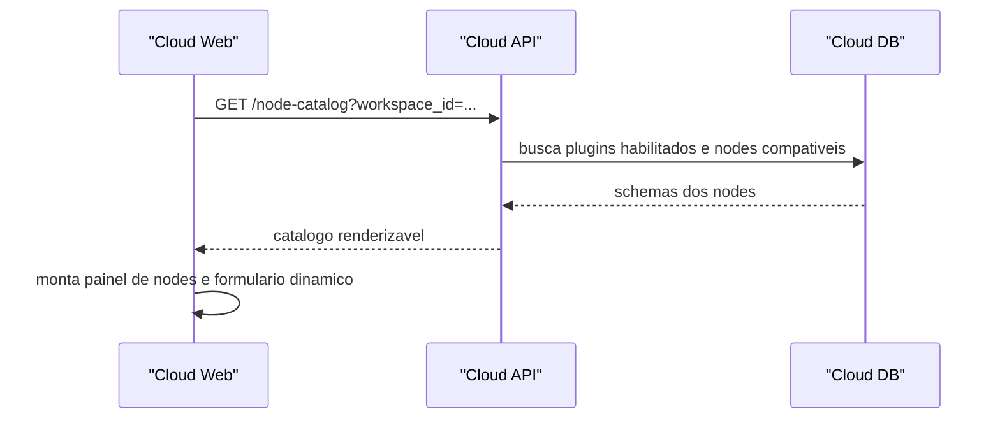

O editor passa a trabalhar com um catalogo dinamico:

```
Core
  SQL Query
  Mapper
  Loop
  Condition

Slack
  Enviar mensagem
  Upload de arquivo
  Listar canais

Cliente ACME
  Buscar ordem no ERP
  Atualizar status de entrega
```

O workflow salvo nao deve conter codigo do plugin. Ele deve conter apenas:

- tipo do node;

- versao esperada;

- configuracao;

- referencias de conexoes;

- mapeamentos;

- expressoes.

Exemplo:

```
{
  "id": "node_42",
  "type": "slack.send_message",
  "plugin": {
    "id": "com.shift.slack",
    "version": "1.0.0"
  },
  "config": {
    "channel": "{{ vars.channel_id }}",
    "message": "Carga concluida: {{ nodes.import.total_rows }} registros."
  },
  "connection_ref": "conn_slack_principal"
}
```

## 23.6 Execucao no Runner Local

O Runner Local precisa sincronizar plugins da mesma forma que sincroniza workflows.

Fluxo recomendado:

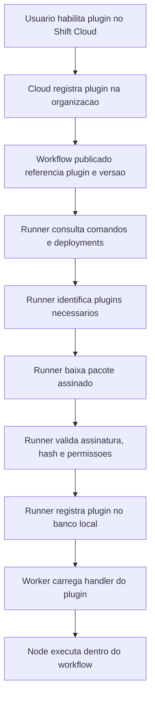

O Runner deve manter um cache local:

```
local_plugins/
  com.shift.slack/
    1.0.0/
      plugin.json
      package.zip
      signature.sig
      extracted/
```

No banco local:

```
local_plugin_versions
  id
  plugin_id
  version
  publisher
  package_hash
  signature_status
  installed_at
  enabled
  compatibility_status
  permissions_json
```

Antes de executar um job, o Agent valida:

- workflow bundle esta assinado;

- todos os plugins exigidos existem localmente;

- versao do plugin atende ao workflow;

- permissoes do plugin foram aprovadas pela organizacao;

- runner/worker sao compativeis;

- secrets necessarios existem no cofre local ou cloud, conforme politica.

Se faltar plugin:

```
job nao inicia
status = blocked_missing_plugin
evento enviado ao cloud
UI mostra acao necessaria
```

## 23.7 Exemplo pratico: conector Slack

Um conector Slack oficial poderia fornecer nodes como:

```
slack.send_message
slack.upload_file
slack.list_channels
slack.create_channel
slack.lookup_user
slack.send_blocks
```

Uso em workflow:

```
Extrair dados do ERP
Validar registros
Inserir no banco destino
Se erro:
  slack.send_message para canal #operacoes
Se sucesso:
  slack.send_message para canal #integracoes
```

O node `slack.send_message` precisaria:

- receber canal;

- receber mensagem;

- resolver expressoes;

- usar token OAuth armazenado em secret;

- chamar API do Slack;

- retornar `ok`, `timestamp`, `channel`;

- mascarar token em logs;

- registrar erro redatado em caso de falha.

O usuario veria o node de forma low-code:

```
Node: Enviar mensagem Slack

Conexao: Slack principal
Canal: #integracoes
Mensagem:
  Workflow {{ workflow.name }} finalizado.
  Registros processados: {{ nodes.load.total_rows }}
```

## 23.8 Triggers e webhooks

Alguns conectores nao sao apenas acoes. Eles tambem podem iniciar workflows.

Exemplos:

- nova mensagem no Slack;

- novo email recebido;

- arquivo criado em pasta monitorada;

- webhook de pedido criado;

- evento de CRM;

- agenda externa.

Para ambientes locais, deve-se preservar o principio outbound.

Modelo recomendado para eventos cloud:

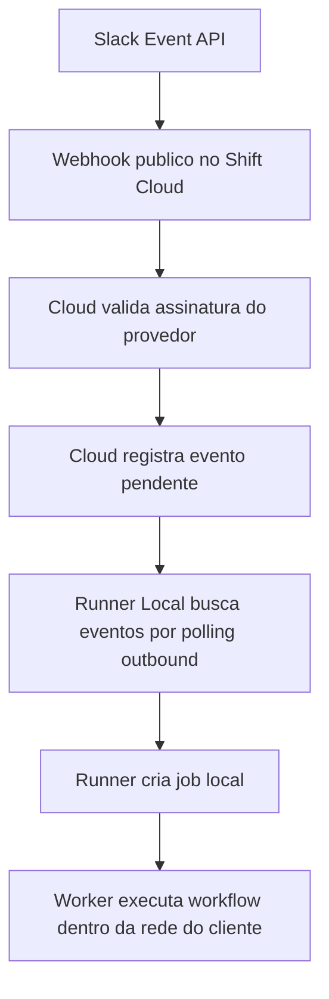

Esse modelo evita abrir porta no servidor do cliente.

Para eventos puramente locais:

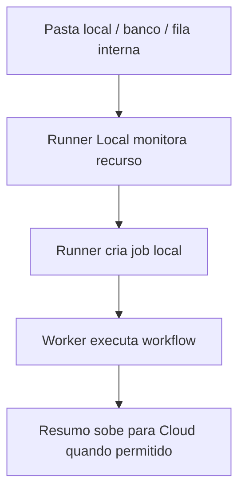

Assim o Shift cobre tanto triggers SaaS quanto triggers locais.

## 23.9 Segredos e conexoes de plugins

Plugins nao devem armazenar credenciais diretamente no workflow.

Modelo correto:

```
workflow referencia connection_ref
connection_ref aponta para secret gerenciado
secret fica no cofre cloud ou local
runner injeta credencial apenas no momento da execucao
plugin nunca grava token em log
```

Para Slack:

```
connection_ref = conn_slack_principal
secret type = oauth2
scopes = chat:write, channels:read
storage = cloud ou local, conforme politica
```

Para ERP local:

```
connection_ref = conn_erp_oracle_cliente
secret type = database
storage = local only
```

Politicas por conexao:

- `cloud_managed`: token fica no cloud, usado por execucoes cloud;

- `local_managed`: token fica apenas no runner;

- `hybrid_reference`: cloud conhece metadados, local guarda segredo real;

- `bring_your_own_secret`: cliente injeta segredo no servidor.

## 23.10 Seguranca de plugins

Essa e a parte mais sensivel.

Plugin de comunidade nao pode ser tratado como simples biblioteca instalada sem controle.

Controles minimos:

- pacote assinado;

- hash imutavel;

- publisher identificado;

- permissoes declaradas;

- aprovacao por organizacao;

- pin de versao por workflow;

- logs redatados;

- secrets acessados por API controlada;

- bloqueio de subprocess por padrao;

- bloqueio de filesystem por padrao;

- allowlist de dominios de rede;

- auditoria de instalacao;

- auditoria de execucao;

- desabilitacao remota de plugin comprometido;

- politica de compatibilidade com runner/worker.

Permissoes devem ser explicitas.

Exemplo:

```
{
  "network": ["https://slack.com"],
  "filesystem": "none",
  "subprocess": false,
  "secrets": ["slack_oauth_token"],
  "local_database": false
}
```

Para plugins privados de cliente, pode haver permissoes maiores, mas com aprovacao explicita:

```
{
  "network": ["https://api.cliente.local", "10.0.0.0/24"],
  "filesystem": ["D:/Integracoes/Entrada", "D:/Integracoes/Saida"],
  "subprocess": false,
  "secrets": ["erp_user", "erp_password"],
  "local_database": true
}
```

No MVP, o isolamento pode ser pragmatico:

- validar assinatura;

- usar ambiente virtual controlado;

- instalar dependencias em pasta isolada;

- nao permitir plugins de comunidade em producao;

- permitir apenas plugins oficiais e privados confiaveis.

Evolucao futura:

- sandbox por processo;

- politicas de rede;

- container opcional quando disponivel;

- WASM para certos tipos de plugin;

- analise estatica antes de publicacao;

- scanner de dependencias.

## 23.11 Banco de dados cloud para plugins

Tabelas sugeridas:

```
plugin_packages
  id
  plugin_id
  publisher_id
  name
  description
  category
  visibility
  trust_level
  created_at

plugin_versions
  id
  plugin_package_id
  version
  runtime_type
  min_runner_version
  min_worker_version
  package_url
  package_hash
  signature
  manifest_json
  permissions_json
  status
  published_at

plugin_nodes
  id
  plugin_version_id
  node_type
  label
  category
  schema_json
  output_schema_json
  icon

organization_plugins
  id
  organization_id
  plugin_package_id
  allowed_version_policy
  enabled
  approved_by
  approved_at

runner_plugin_state
  id
  runner_id
  plugin_id
  version
  installed
  last_seen_at
  compatibility_status
```

Essas tabelas permitem responder perguntas importantes:

- qual cliente usa qual plugin;

- qual runner tem qual versao instalada;

- quais workflows dependem de um plugin;

- quais plugins podem ser atualizados;

- qual plugin deve ser bloqueado em caso de incidente;

- quais nodes devem aparecer no editor para cada organizacao.

## 23.12 Banco local para plugins

No Runner Local:

```
local_plugin_versions
  id
  plugin_id
  version
  publisher
  package_hash
  installed_path
  signature_status
  permissions_json
  installed_at
  enabled

local_plugin_nodes
  id
  plugin_id
  plugin_version
  node_type
  schema_json
  output_schema_json

local_plugin_audit
  id
  plugin_id
  plugin_version
  action
  execution_id
  node_id
  created_at
  details_json
```

O banco local nao precisa replicar todo marketplace. Ele precisa guardar apenas o que o runner usa.

## 23.13 Estrutura de pastas no monorepo

Adicionar uma area propria para plugins e contratos:

```
shift-project/
  apps/
    cloud-web/
    cloud-api/
    local-worker/
    runner-agent/

  packages/
    execution-core/
    contracts/
    plugin-sdk-python/
    plugin-sdk-typescript/

  plugins/
    official/
      slack/
      teams/
      http/
      files/
    private/
      README.md
    examples/
      sample-http-connector/
      sample-python-node/

  docs/
    arquitetura-hibrida-cloud-runner.md
    plugin-development-guide.md
    plugin-security-model.md
```

O `plugin-sdk-python` deveria oferecer APIs como:

```
from shift_sdk import NodeContext, node

@node("slack.send_message")
def execute(ctx: NodeContext, channel: str, message: str):
    token = ctx.secrets.get("slack_connection")
    ctx.log.info("Sending Slack message", extra={"channel": channel})
    result = ctx.http.post(
        "https://slack.com/api/chat.postMessage",
        bearer_token=token,
        json={"channel": channel, "text": message},
    )
    return {
        "ok": result["ok"],
        "timestamp": result.get("ts"),
        "channel": result.get("channel"),
    }
```

O plugin nao acessa diretamente:

- banco de segredos;

- banco local;

- token bruto de runner;

- API cloud interna;

- filesystem fora das permissoes.

Ele acessa tudo via `ctx`.

## 23.14 Ciclo de vida de um plugin

Fluxo recomendado:

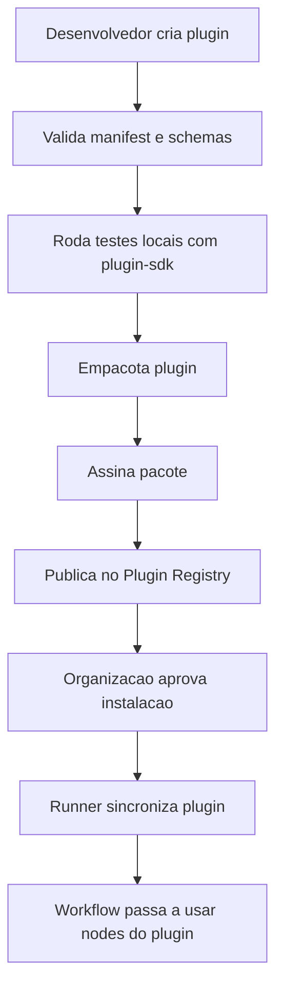

Estados possiveis:

```
draft
submitted
verified
published
deprecated
blocked
removed
```

Um plugin bloqueado nao deve ser usado em novos jobs.

Workflows ja publicados podem:

- falhar com `plugin_blocked`;

- continuar em grace mode, se o bloqueio nao for critico;

- exigir aprovacao manual para continuar.

Essa politica deve ser configuravel, mas o padrao precisa ser seguro.

## 23.15 Versionamento e compatibilidade

Workflows devem fixar versao de plugin.

Exemplo:

```
{
  "plugin": "com.shift.slack",
  "version": "1.0.0"
}
```

Evitar executar automaticamente a versao mais nova sem validacao, porque um plugin pode alterar comportamento.

Politica recomendada:

- patch pode ser sugerido automaticamente;

- minor exige validacao do workflow;

- major exige migracao explicita;

- workflow publicado fica preso a versao usada no momento da publicacao;

- runner baixa exatamente as versoes necessarias para aquele bundle.

Para ajudar o usuario:

```
Slack 1.0.0 -> 1.0.3
Atualizacao segura, correcoes internas.

Slack 1.0.0 -> 1.1.0
Novos campos disponiveis. Recomenda-se validar workflow.

Slack 1.0.0 -> 2.0.0
Breaking changes. Migracao manual necessaria.
```

## 23.16 Impacto no Procedure Flow

O Procedure Flow vertical tambem se beneficia desse modelo.

Em vez de ter apenas blocos fixos, ele poderia aceitar nodes vindos de plugins:

```
Loop produtos
  SQL Query
  Mapper
  If estoque baixo
    slack.send_message
  oracle.execute_statement
  audit.write_event
```

Isso permite misturar:

- comandos SQL;

- transformacoes;

- chamadas externas;

- validacoes;

- notificacoes;

- auditoria;

- integracoes com ERPs;

- chamadas de IA.

O Procedure Flow continuaria sendo AST/estrutura indentavel, mas seus blocos poderiam vir do mesmo catalogo de nodes.

## 23.17 Fases recomendadas para implementar plugins

### Fase P0 - Preparar contratos

Criar os contratos antes de criar marketplace.

Entregas:

- `plugin.json`;

- `node.schema.json`;

- validadores;

- manifest parser;

- modelo de permissoes;

- armazenamento de catalogo no cloud;

- renderizacao basica no frontend.

### Fase P1 - Migrar nodes internos para formato declarativo

Nao precisa transformar tudo em plugin de uma vez.

Comecar por alguns nodes:

- HTTP Request;

- Slack;

- File;

- SQL Query.

Objetivo:

- provar que o frontend renderiza por schema;

- provar que o worker executa por registry;

- manter compatibilidade com nodes antigos.

### Fase P2 - Primeiro plugin oficial: Slack

Slack e um bom primeiro conector porque:

- tem API bem documentada;

- traz valor visivel;

- exige secrets/OAuth;

- tem acoes simples;

- permite testar logs redatados;

- pode ser usado em automacoes reais.

Nodes iniciais:

- `slack.send_message`;

- `slack.list_channels`;

- `slack.upload_file`.

### Fase P3 - Plugins privados

Permitir que uma organizacao instale plugins privados.

No inicio, apenas por upload administrativo:

- zip assinado;

- manifest validado;

- allowlist por organizacao;

- sem marketplace publico.

### Fase P4 - Conectores low-code

Criar um builder de conectores HTTP:

- endpoint;

- autenticacao;

- headers;

- query params;

- body;

- resposta;

- testes;

- publicacao como node.

Esse recurso pode gerar muito valor antes de abrir plugins com codigo.

### Fase P5 - Marketplace controlado

So depois de amadurecer:

- revisao;

- trust levels;

- pagina publica do plugin;

- documentacao;

- avaliacao;

- instalacao por organizacao;

- bloqueio remoto;

- telemetria de uso.

## 23.18 Recomendacao objetiva

Para o Shift, a estrategia mais segura e:

```
1. Criar Node Registry interno.
2. Fazer frontend renderizar nodes por schema.
3. Fazer worker resolver handler por registry.
4. Criar plugin oficial Slack como prova real.
5. Liberar plugins privados para consultoria.
6. Criar conectores low-code HTTP.
7. Somente depois abrir marketplace/comunidade.
```

Isso evita transformar o produto cedo demais em uma plataforma dificil de controlar, mas ja cria a fundacao correta.

O ponto central:

```
Plugin nao e apenas um pacote de codigo.
Plugin e um contrato versionado entre produto, usuario, runner, seguranca e execucao.
```

Essa decisao aumenta muito o potencial comercial do Shift. Em vez de vender apenas uma ferramenta de ETL, o produto passa a ser uma plataforma extensivel de automacao, com ecossistema proprio de conectores.

---

## 24. Conclusao

A arquitetura hibrida Shift Cloud + Runner Local e uma evolucao natural para transformar o Shift em plataforma de automacao para consultoria.

Ela permite:

- experiencia web centralizada;

- execucao local segura;

- suporte a ambientes Windows/Linux sem Docker/WSL;

- governanca por licenca/plano;

- monitoramento de multiplos clientes;

- manutencao do motor Python atual;

- separacao clara entre produto SaaS e operacao local.

A decisao mais importante e nao tentar reescrever o motor. O caminho pragmatico e:

```
Cloud API/Web para governanca
Go Agent para instalacao/supervisao/sync
Python Worker para execucao
Execution Core como pacote compartilhado
```

Isso equilibra robustez operacional, velocidade de entrega e reaproveitamento do investimento ja feito no Shift.
